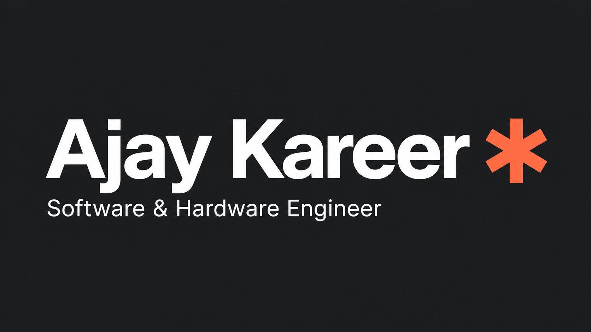

<div align="center">



# Software meets the real world.

**My personal portfolio — iOS apps, business tools, and the systems behind them.**

<p>
  
  
  
  
  
</p>

[Explore the projects](#featured-projects) · [Run locally](#run-locally) · [Customize](#make-it-yours) · [LinkedIn](https://www.linkedin.com/in/ajaykareer/)

</div>

---

## About

I'm **Ajay Kareer**, a Software & Hardware Engineer at **CreativePOS** since June 2024, based in Ajax, Ontario. I build iOS apps, practical business software, and tools that connect software with the hardware people use every day.

This repository contains my portfolio website. It brings my projects, experience, and background together in an app-like interface with five views: **Overview · Projects · Experience · About · Contact**.

## The experience

| Feature | What it does |
| --- | --- |
| ☀️ Light & dark themes | A warm drafting-grid light theme and a dark theme, with light mode on a fresh visit. |
| ✨ Purposeful motion | Page transitions and staggered scroll reveals, with a saved motion preference. |
| ⌘ Quick jump | Search pages and projects with **Ctrl / Cmd + K**. |
| 🗂️ Project explorer | Filter by category and open detailed project stories, screenshots, and links. |
| 🌍 Interactive contact | A rotating globe, moving stars, and a contact form with validation and delivery feedback. |
| ♿ Thoughtful controls | Keyboard navigation, visible focus, reduced-motion support, and responsive layouts. |

Native scrolling, responsive WebP images, and browser-native custom cursors keep the interface lightweight. The globe pauses when offscreen or hidden.

## Featured projects

These are projects showcased by the portfolio; their application source code is separate from this website.

| Project | Built for | Explore |
| --- | --- | --- |
| **Creative POS Reporting** | Sales dashboards, daily and monthly reports, and configurable POS activity notifications for authorized business owners and managers. | [App Store](https://apps.apple.com/ng/app/creative-pos-reporting/id6799240504) |
| **Kareer’s Walls** | High-quality iPhone wallpapers, curated collections, favourites, and a personalized For You feed. | Personal iOS project; public download not available yet |
| **Word Shuffle** | A Salesforce word game with difficulty levels and saved results, built with Aura and Apex. | [Source](https://github.com/ajaykareer/Word-Shuffle-Game-Salesforce-Aura) |
| **Windows Update Manager** | Menu-driven Windows update controls for POS terminals, kiosks, and PCs. | [Source](https://github.com/ajaykareer/Windows-Update-Manager) |

<details>
<summary><strong>More projects</strong></summary>

- **[AKK Web Gallery](https://github.com/ajaykareer/web-gallery)** — a React and Firebase photo-gallery project.
- **[DavosBet](https://github.com/ajaykareer/davosbet)** — a sports interface exploring scores, standings, and external data.
- **[The Weather App](https://github.com/ajaykareer/WeatherAPP)** — a responsive city-weather lookup.

AKK Web Gallery and DavosBet are adaptations of Diego Arndt's projects; attribution is retained in the portfolio.

</details>

## Under the hood

| Layer | Technology |
| --- | --- |
| Interface | React 19 + TypeScript |
| Framework & build | Vinext + Vite, exported as a static site |
| Styling | Tailwind CSS 4 + custom CSS |
| Controls | Base UI, shadcn, and Lucide icons |
| Animation | Motion |
| Globe | COBE, loaded on the Contact view |
| Image preparation | Sharp + responsive WebP variants |

## Run locally

Use **Node.js 22**; the project was tested with **22.22.0**. Download or clone this repository, then open the project folder in your terminal:

```bash
npm ci
npm run dev
```

Open the local URL printed in the terminal, usually **http://localhost:3000**.

### Build & preview

```bash
npm run build
npm run preview
```

The static site is generated in `dist/client`. Preview it at **http://localhost:4173**. This output can be deployed to a static host; uploading source to GitHub alone does not deploy the website.

<details>
<summary><strong>Using Node 24 on Windows?</strong></summary>

Node 24.11.1 can encounter a Windows process-shutdown error after a successful Vinext build. Use Node 22, or run the verified build command:

```bash
npx --yes --package=node@22.22.0 node node_modules/vinext/dist/cli.js build
```

</details>

## Make it yours

| File | What to change |
| --- | --- |
| [`app/portfolio.tsx`](app/portfolio.tsx) | Projects, main content, navigation, and links |
| [`app/profile-background.tsx`](app/profile-background.tsx) | Education, credentials, and earlier experience |
| [`app/globals.css`](app/globals.css) | Theme tokens, typography, and layout |
| [`app/premium.css`](app/premium.css) | Light-theme surfaces, project cards, artwork, and cursors |
| [`app/page-motion.tsx`](app/page-motion.tsx) | Page transitions, reveals, and motion preferences |
| [`app/contact-page.tsx`](app/contact-page.tsx) | Contact form and feedback |
| [`app/contact-orbit.tsx`](app/contact-orbit.tsx) | Globe and starfield |
| [`lib/contact.ts`](lib/contact.ts) | Contact delivery configuration and validation |
| [`app/layout.tsx`](app/layout.tsx) | Metadata, fonts, and social preview |
| [`public/projects`](public/projects) | Portrait and project images |

See the [development notes](docs/development.md) for contact setup and asset maintenance, and the [GitHub guide](docs/github-guide.md) for saving future changes.

## Quality checks

```bash
npx tsc --noEmit
node --experimental-strip-types --test tests/contact.test.mjs
```

Contact tests use mocked requests and send no email. The [QA report](docs/qa-report.md) records the September 2026 desktop, mobile, keyboard, and contact checks, including their limits. Content references and credits are listed in [content sources](docs/content-sources.md).

---

<div align="center">

**Apps. Systems. Ideas.**

[Ajay Kareer](https://github.com/ajaykareer) · [LinkedIn](https://www.linkedin.com/in/ajaykareer/)

</div>
